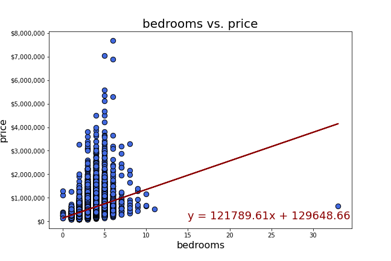

# House Sales in King County, USA

## Project Description
The House Sales in King County, USA dataset contains house sale prices for King County, which includes Seattle from May 2014 to May 2015. It will be used to determine if certain house features have an effect on the price of house sales.
 

## Process

## Research Question
Do house features have an effect on the price of house sales?

## House Features
*	Bathrooms & bedrooms
*	Sq_ft living
*	Zipcode
*	Waterfront view
*	Year house was built

## Hypothesis
House features do have an effect on the price of house sales.

## Bedrooms & Bathrooms

The average amount of bedrooms and bathrooms is 3 bedrooms and 2.11 bathrooms. The “Amount of Bathrooms” histogram shows the highest amount of sold houses have 3 bedrooms while the “Amount of Bathrooms” histogram shows the highest amount of sold houses have 2.5 bathrooms. Based on the average and mode of bedrooms and bathrooms, this can mean that a majority of sold houses have 3 bedrooms and 2 to 2.5 bathrooms.

### Is the price higher when there are more bedrooms or bathrooms?

Price is higher for houses with more bedrooms or bathrooms, but only to a certain extent as shown in the scatter plots: “Bedrooms vs. Price” and “Bathrooms vs. Price” and bar graphs: “Average Price by Bedrooms Bar Graph” and “Average Price by Bathrooms Bar Graph” and as indicated by the r-squared value which describes the correlation between the bedrooms and price and bathrooms and price. Since the r-squared value for bedrooms and price is 0.308, there’s a weak correlation between the amount of bedrooms and price. On the other hand, since the r-squared value for bathrooms and price is 0.525, there’s a moderate correlation between the amount of bathrooms and price.

In addition, both scatter plots and bar graphs show that there’s an increase in price up to a certain amount of bedrooms or bathrooms, however after that certain amount of bedrooms or bathrooms is reached, the majority of houses sold have prices that are less than those houses with less bedrooms or bathrooms.

The majority of sold houses have prices that range from $75,000 to $4 million. As the amount of bedrooms increase from 0 to 6 in and bathrooms increase from 0 to 5, the majority of sold houses have prices that are costlier/ close to $4 million, but as the amount of bedrooms and bathrooms increase, the majority of sold houses aren’t as expensive as those with less than 6 bedrooms or less than 5 bathrooms since the majority of those sold houses that have more than 6 bedrooms or more than 5 bathrooms have lower prices that aren’t as close to $4 million.

Also, the outliers of 11 and 33 bedrooms sold at $520,000 and $640,000 emphasizes that not all houses with many bedrooms have a high price since these 2 sold houses have the most bedrooms in this dataset, but they weren’t sold at the highest price. 

## Sqft_living

### What’s the correlation between sqft_living and pricing and do larger sqft_living greater than 6,000 sqft with a waterfront view cost more or less than those without a waterfront view?

## Zipcode

### Are house sale prices higher in higher income neighborhoods?

## Waterfront view

### Do houses with a waterfront view or without a waterfront view have more price outliers?

## Year house was built

### Do newly built homes cost more than older built homes and where/ which zipcodes are the majority of the newly built homes located at?

According to the plots below, newly built homes do not cost more than older homes in general. However there seems to be a stronger correlation between price and home if it has been renovated. This could be due to fewer data points in the year renovated plot (only 4.2% of the homes have been renovated).

